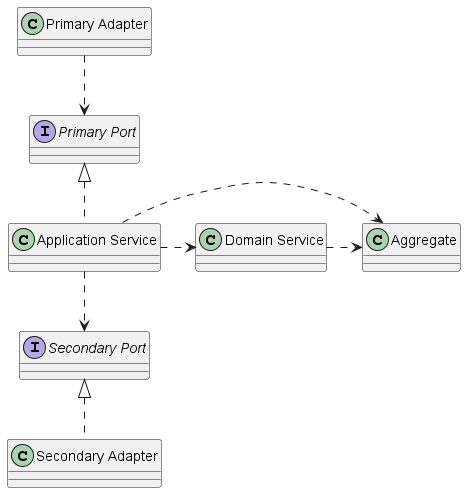

# Phone Booking Demo Application
## Overview
The application is a demo/POC application of an application that serves a team of Mobile App testers\
to manage (book/return) mobile phones for testing.\
The Mobile Phones are booked by the Administrator and also returned to the warehouse by the Administrator.

When the app opens it will show a login screen, use admin/password for credentials, after logging in, a screen\
with a list of registered testers will be shown. A tester can be selected after which a new screen is shown.\
The new screen shows mobile phones which the tester has booked and also a list of phones available for booking.\
On this page the phones can be booked and returned.

There is still lots left to be desired:
- security (CSRF for example, in-memory user credentials, ...)
- logging and observability
- error handling needs to be improved
- some rules of DDD were not followed to the letter and some improvements can be made, for example some data maping was
done in Domain Services having getters exposed on Aggregates instead of using something like a Strategy Pattern, also
Aggregates were tied to a specific storage implementation - JPA
- jMolecules 'DDD and Ports & Adapters Architecture' Archunit tests need to be added
- and last but not least, the UI will make your eyes bleed, be warned

### Technologies used
- Java 21
- Spring Boot 3.2
- Spring Data JPA
- jMoleclues
- Lombok
- Flyway
- PostgreSQL
- HTMX
- Tailwind CSS
- Docker / Docker Compose
- Maven

## Installation / running
### Prerequisites
- JDK 21
- Docker

### Steps
- checkout the repository
- open the shell/cmd in the root of the project
- compile the app using the Maven wrapper
  - Windows: .\mvnw compile
  - Linux: ./mvnw compile
- run the app using the Maven wrapper
  - Windows: .\mvnw spring-boot:start
  - Linux: ./mvnw spring-boot:start
- open the URL 'http://localhost:8080' in the browser
- stop the application using the Maven wrapper
  - Windows: .\mvnw spring-boot:stop
  - Linux: ./mvnw spring-boot:stop
#### Note: PostgreSQL is started on standard port 5432 using Docker Compose

## Domain-Driven Design and Ports & Adapters architecture with Java, Spring Boot and jMolecules - overview

### Primary Adapter
Primary adapters receive requests from external (often Controllers / RestControllers) and use Primary Ports.
- Spring Controllers
    - found in packages: vasler.devicelab.adapters.primary.*

### Primary Port
Primary Port is the interface between Primary Adapters and the Application Service (Application Layer),\
Pirmary Ports are implemented by the Application Services. The Primary Port defines the use cases for the Domain.
- Primary Ports are Java interfaces whose names end with 'UseCase'
  - found in packages: vasler.devicelab.ports.primary.*

### Application Service
Application Service implements the Primary Port to receive requests from outside, the Application Service should hold\
no Domain logic, it only manages application resources like transactions and security.
- Application Services are implemented as Spring Services whose names end with 'Service'
  - found in packages: vasler.devicelab.service.*

### Aggregate
Aggregate is one of the main building blocks of tactical DDD, it holds not only the data but also the Domain logic.\
Aggregate is composed of at least one Entity and may consist of multiple Entities and Value Objects.
- Entities
  - found in packages: vasler.devicelab.domain.model.*

### Domain Service
If the Domain logic spans more than one Aggregate the Domain Service may host that logic, other approach, often better,\
is to use Domain Events, not used in this POC.
- Spring Service
  - found in the package: vasler.devicelab.domain.service

### Secondary Port
Secondary Ports is the interface between the Application Service (Application Layer) and the Secondary Adapter,\
Secondary Ports are implemented by Secondary Adapters. The Application Service uses Secondary Ports to issue calls\
to external services.
- Spring Repository
    - found in packages: vasler.devicelab.ports.secondary.*

### Secondary Adapter
Secondary Adapters issue calls to external services and implement Secondary Ports.
- Spring Repositories
  - implemented by Spring

### Note: The application has a standard Spring Boot application layout, package names reflect the architectural concepts outlined above.
